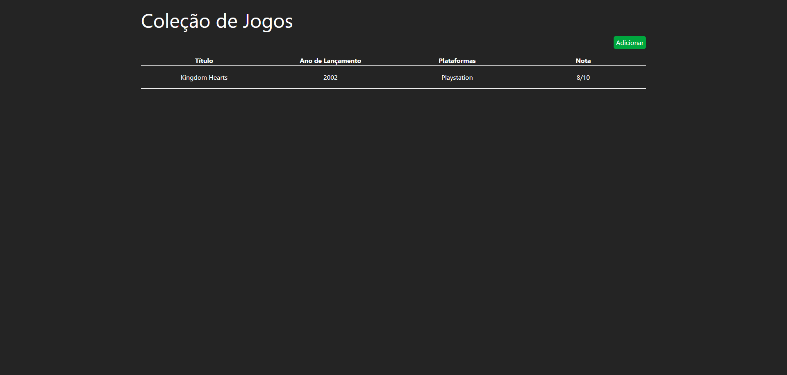
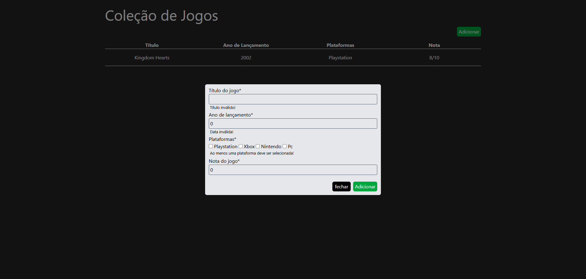
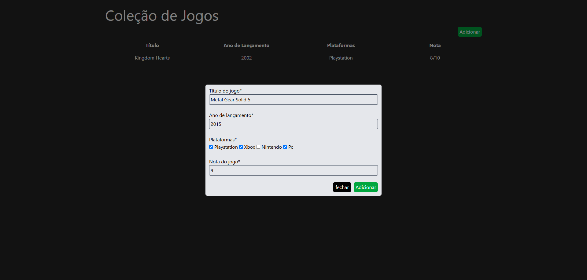
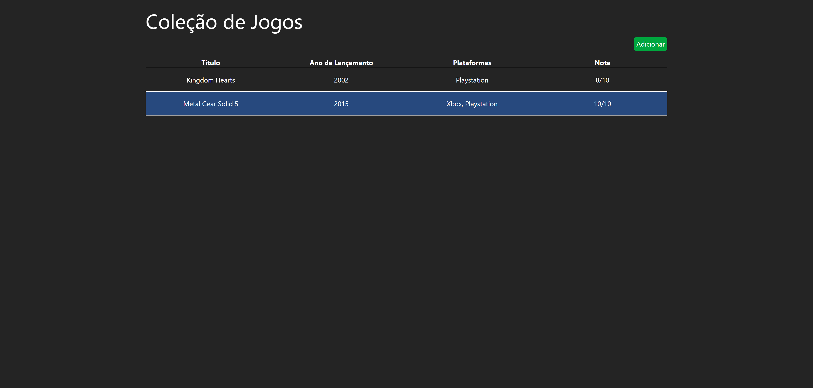
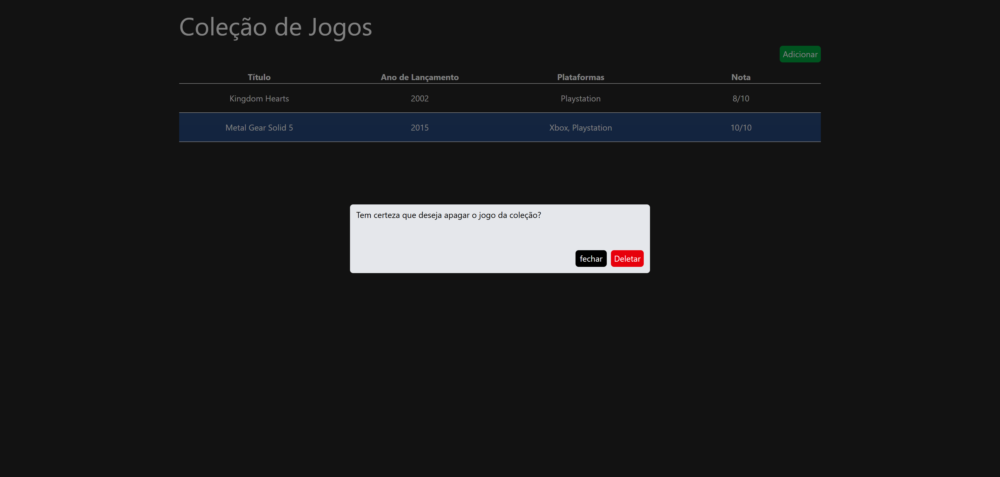

# Game Collection

Projeto de CRUD fullstack desenvolvido como parte de um desafio técnico. A aplicação tem como função armazenar, editar ou excluir jogos, para fins pessoais. O objetivo principal foi construir uma aplicação funcional com boas práticas de desenvolvimento.

## 📷 Prints do projeto

    
    
    
    
    
    
    
    

## 🚀 Instruções de instalação

Clone o repositório:

```bash
git clone https://github.com/PedroAugusto31/JR-Pedro-Augusto.git
```

**Atenção:** A partir daqui é necessário que você tenha o [node]("https://nodejs.org/pt/download") para poder instalar as dependências do projeto.

**Obs:** No Linux você pode instalar o node por meio do comando abaixo.

```bash
sudo apt install -y node.js
```

Com o projeto clonado em sua máquina, acesse os diretórios `front-end` e `back-end` pelo terminal e, um de cada vez, execute o comando:

```bash
yarn install
# ou
npm install
```

Após todas as dependências instaladas, crie um arquivo `.env` dentro da pasta "back-end" e crie as variáveis de ambiente da seguinte forma:

```env
DB_USERNAME="[seu usuário do MySQL]";
DB_PASSWORD="[sua senha do MySQL]";
```

Então com o terminal no diretório `back-end`, crie o banco de dados executando o seguinte comando:

```bash
npx ts-node scripts/init-db.ts
```

Por fim, para iniciar o servidor back-end, rode:

```bash
npm run start:dev
# ou
yarn start:dev
```

E para iniciar o front-end:

```bash
npm run dev
# ou
yarn dev
```

## 💻 Tecnologias utilizadas

> ### Front-end

- **Vue.js + Vite:** Escolhi o Vue para aprender um novo framework e utilizei o Vite pela configuração rápida e desempenho no desenvolvimento.

- **TailwindCSS:** Usei Tailwind pela abordagem utilitária que agiliza e padroniza a estilização dos componentes.

> ### Back-end

- **Node.js / NestJS:** O NestJS foi escolhido por ser uma estrutura escalável, com suporte a TypeScript e arquitetura modular.

- **MySQL:** Escolhi o MySQL por ser um banco relacional confiável e amplamente utilizado.

- **TypeORM:** Usei o TypeORM pela integração com TypeScript e por facilitar a criação e gerenciamento das entidades.

## O que eu faria diferente com mais tempo?

- Deixaria o front-end responsivo.

- Faria testes unitários tanto no front-end quanto no back-end.

- Aprenderia docker pra dockerizar o projeto.

- Faria deploy do projeto (mesmo que fosse simples).

## O que eu gostaria de melhorar no projeto?

- Atualizar UI para melhorar a experiência do usuário.

- Criaria funcionalidade para desfazer a ação de apagar.
